# OS--Final-Docker-Challenge
# Challenge 3

Challenge 3 Journal

Date: 2024-04-19

Objective
Implement a full-stack application using Docker Compose, incorporating a database component.

Steps Taken

1 Folder Setup

Used the provided folder challenge3.
Added all files present in challenge3.zip to the challenge’s root folder.

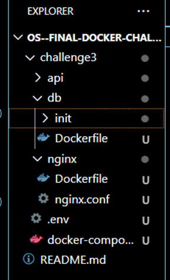
 

2 Environment Configuration

Created the .env file with appropriate values for the configuration variables:
 
 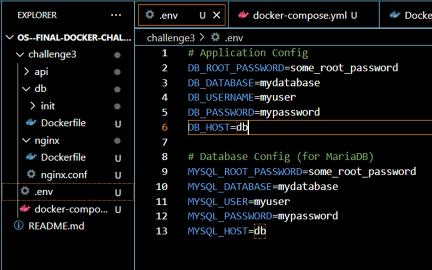

3 Docker Compose Setup

Created the docker-compose.yml file with configurations for three services:
•	nginx
•	node-service
•	db

 

4 Service Verification

Ensured all services were running properly:

First Step:

 
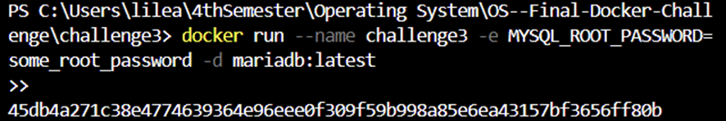

Second Step:

Checked using docker-compose ps.
Verified that all containers were up and running without any errors.

 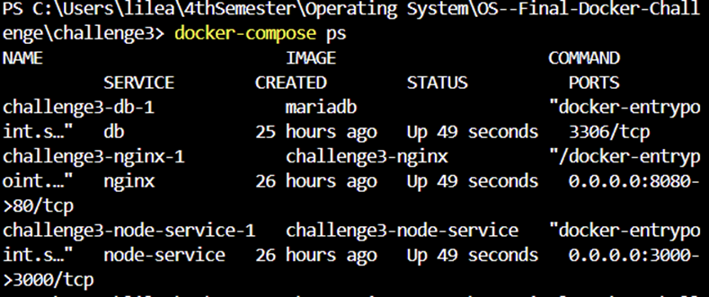

You can check the status of the containers by Docker app:

 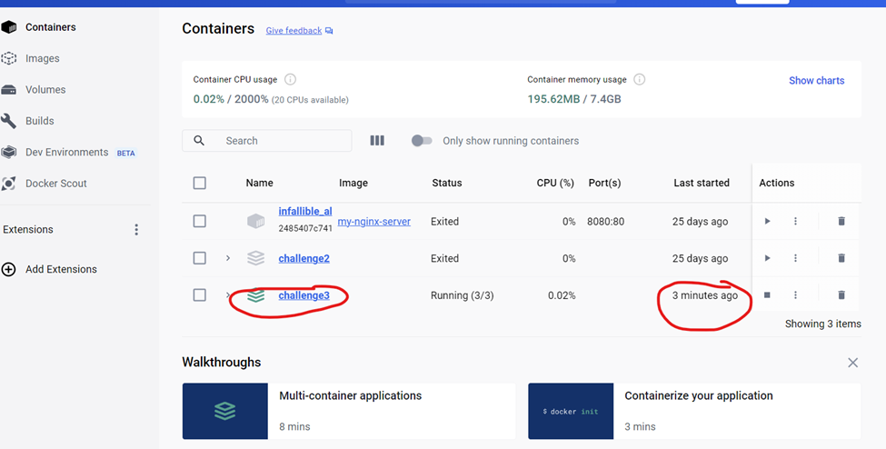
 
 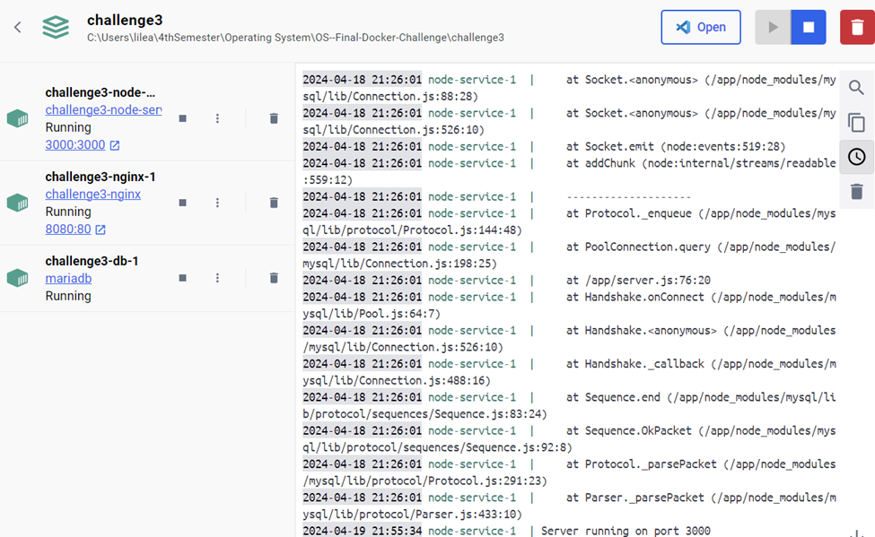

5 Application Testing

Accessed the endpoints:
http://localhost:8080/api/books
http://localhost:8080/api/books/1
Ensured that the expected JSON messages were returned.

6Expected Outcomes

Accessing http://localhost:8080/api/books should return a JSON message with all books:
 
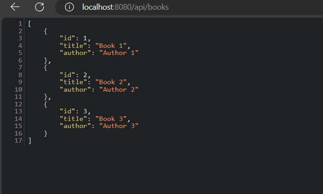

Accessing http://localhost:8080/api/books/1 should return a JSON message with one book:

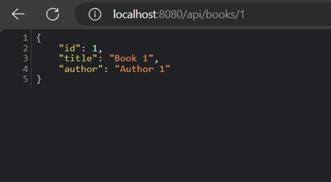
 
Executing docker-compose ps should show all services running properly.

Challenges Faced

•	The initial setup process was challenging due to insufficient instructions provided.
•	Spent several days researching and understanding database setup and environment variable configurations.
•	Lack of detailed guidance led to the need for independent research to gather required information.

Observations

Despite the initial challenges, the implementation process enhanced my understanding of Docker Compose and database integration.
Learned the importance of thorough documentation and clear instructions in technical tasks.

Conclusion

By overcoming initial hurdles and conducting independent research, the full-stack application was successfully implemented, demonstrating effective integration of web server, application, and database components using Docker Compose.

## Challenge 4 – Scaling up an application

# Goals

Increase the number of node instances from one to three.
Recognize the advantages of running multiple instances as opposed to just one

# Steps

# Preparation

Make use of Challenge 3's application as the foundation.
Make sure Docker and Docker Compose are properly installed and operating.

# Initial Testing

1. Use the browser to access the application and confirm that it is operating correctly.
2. Go to http://localhost:8080/api/stats on the web.
3. Take note of the hostname field that the response returned.
4. Write down the hostname so you can compare it later.

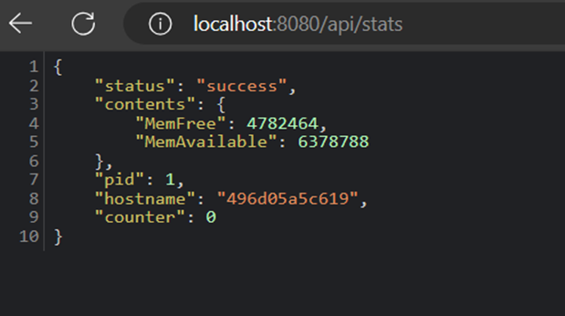

 

# Scaling up the Node Service

1.	Research how to scale up a specific service in Docker Compose.
2.	To scale the node service to three instances, use the docker-compose up —scale node-service=3 command.
3.	Hold off until the scaling procedure is finished.

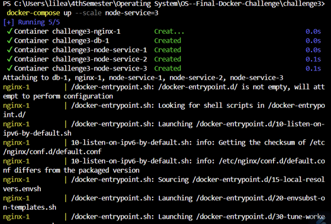 

# Testing after Scaling

Access the URL: http://localhost:8080/api/stats multiple times.

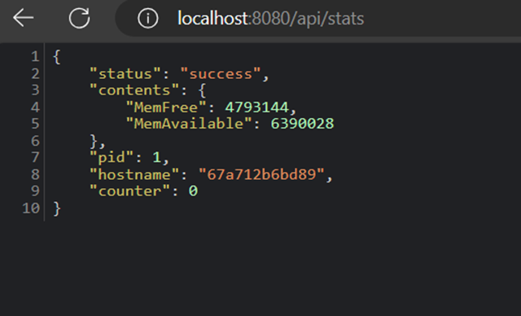
 
Record the hostname field returned in the response for each request.

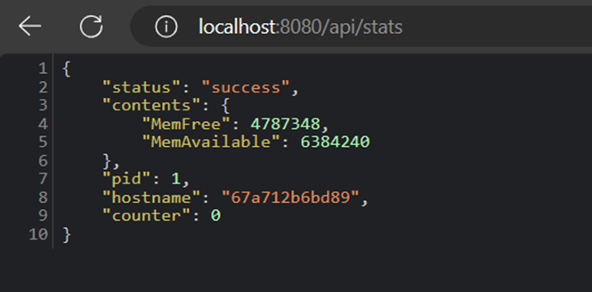
 
Compare the recorded hostnames with the initial ones.
Verify if there's any difference and observe the Round-Robin effect of load balancing.

# Final Verification

To see the current state of every container, run the docker-compose ps command.
Verify that the node service is operating in three instances.
 
 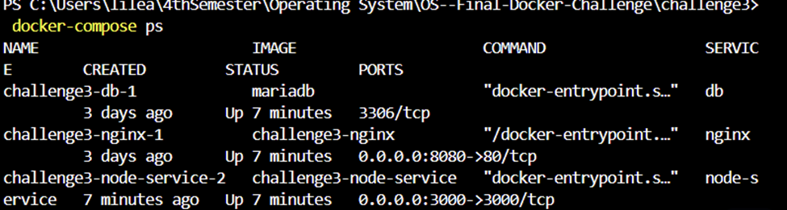

# Expected Outcomes

Before scaling up the node service:

The hostname field in the response from http://localhost:8080/api/stats remains the same for repeated requests.

After scaling up the node service:

Three distinct hostnames are displayed in the hostname field of the response from http://localhost:8080/api/stats, which reflects the load balancing amongst the three node service instances.

# Challenges Faced

These two challenges could have been completed much more efficiently, yet due to unclear instructions, they ended up consuming more time than expected. The lack of detailed guidance necessitated several days of additional research and troubleshooting to complete the assignment. Unfortunately, despite the effort invested, I still find myself lacking a comprehensive understanding of Docker. Moving forward, clearer instructions and more accessible learning resources would greatly facilitate the learning process and improve the overall experience of tackling such tasks.